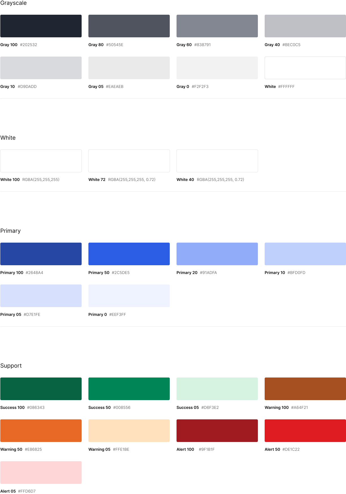

# Awesome GCL

Foundation React UI components for shipping new projects faster

## Installation

```bash
npm i awesome-gcl
```

## Getting started with Awesome GCL

**React:**
```jsx
import { Button } from 'awesome-gcl'
```

**Next js:**
```jsx
'use client'
import { Button } from 'awesome-gcl'
```

**Remix:**
```jsx
// remix.config.js
export default {
  ...,
  serverDependenciesToBundle: [
    /awesome-gcl/
  ]
}

// app/routes/route.tsx
import { Button } from 'awesome-gcl'
```

## Components directory
- Button
- Icon Button
- Text Button
- Checkbox
- Figure
- Input
- Modal
- Radio
- Select
- Select Multi
- Switch
- Table
- Toast List
- User

## Customize a component
Add new css rules or overwrite the existing ones

As GCL build its components with Tailwind CSS, it gets easier to custom the styles by simply passing custom css classes to the additional classes object available.

### Custom classes
```jsx
.modal-wrapper {
  z-index: 999;
}

.modal-dialog {
  background-color: beige;
}
```

### Component
```jsx
<Modal
  isOpen={true}
  additionalClasses={{
    wrapper: [
      'modal-wrapper'
    ],
    dialog: [
      'modal-dialog'
    ]
  }}
>
</Modal>
```

## Library color set
```jsx
let colors = {
  white: {
    100: '#FFFFFF',
    72: '#FFFFFFB8',
    40: '#FFFFFF66',
  },
  grayscale: {
    100: '#202532',
    80: '#50545E',
    60: '#838791',
    40: '#BEC0C5',
    10: '#D9DADD',
    5: '#EAEAEB',
    0: '#F2F2F3',
  },
  primary: {
    100: '#2648A4',
    50: '#2C5DE5',
    20: '#91ADFA',
    10: '#BFD0FD',
    5: '#D7E1FE',
    0: '#EEF3FF',
  },
  support: {
    success: {
      100: '#086343',
      50: '#008556',
      5: '#D6F3E2',
    },
    warning: {
      100: '#A64F21',
      50: '#E86825',
      5: '#FFE1BE',
    },
    alert: {
      100: '#9F1B1F',
      50: '#DE1C22',
      5: '#FFD6D7',
    },
  }
}
```

